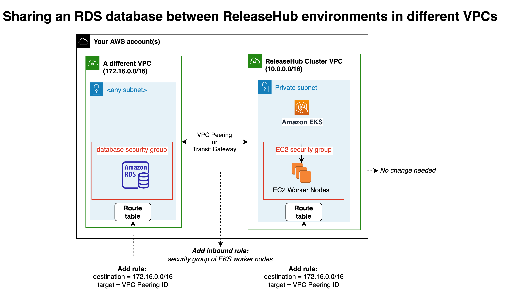

# Shared database with ephemeral ReleaseHub environments

[ReleaseHub](https://releasehub.com/) allows you to quickly create on-demand, ephemeral and permanent environments that run in **your** AWS and GCP cloud accounts. Customers create environments by selecting a GitHub, BitBucket, or GitLab branch, creating a single YAML _Environment Template_, and either issuing a click, an API, or CLI command. ReleaseHub supports mono and poly-repo, microservice and monolith, and - optionally - bring-your-own infrastructure as code to further customize your environment.

In this project, we will provide an illustrative example of how ReleaseHub customers can create a shared database used by multiple ephemeral ReleaseHub environments.

_If you'd like to learn more about ephmemeral, on-demand environments, please contact us at https://releasehub.com._

## Introduction to Ephemeral Databases

[ReleaseHub Instant Datasets](https://docs.releasehub.com/reference-guide/instant-datasets) allow you to create and restore any existing snapshot from Amazon RDS or GCP CloudSQL into it's own ephemeral database instance and quickly attach it to an ephemeral environment with two lines of YAML like that shown below:

```yaml
# ReleaseHub Application Template
datasets:
  - name_of_your_dataset
```

ReleaseHub Instant Datasets are useful when your ephemeral test environments require all of the following: 

* _Real_ RDS or CloudSQL databases
* Identical copies of a recent production or santized database snapshot
* An isolated database instance with each environment
* Automatic teardown of the database when your ephemeral environment is terminated

By meeting these criteria, ReleaseHub Instant Datasets allow customers to:

* improve test reliability by closely mirroring production
* avoid noisy neighbors that are inherent with shared infrastructure
* avoid false-negative test failures due to unexpected data or schema changes

However, if you want a real RDS or CloudSQL shared test database restored from a recent snapshot but you don't require a separate database instance for each ephemeral environment, using a shared database may be a better choice. A shared database not only simplifies your overall cloud footprint, but it may also improve resource utilization and reduce your infrastructure spend cost.

## AWS VPC configuration

The following sections give an overview of setting up AWS VPC networking for a shared database when the database is in the same VPC or a different VPC than the ReleaseHub-managed Amazon EKS cluster.

### Shared RDS Database in same VPC as ReleaseHub EKS cluster

This diagram gives a high-level overview of the AWS architecture needed to share an RDS database between multiple ReleaseHub environments when the database is in the same VPC as the ReleaseHub EKS cluster:


#### Prerequisites

1. You've already created a database (e.g. manually, or with your own CloudFormation) in the same VPC as the ReleaseHub-managed cluster containing environments that will connect to it.

2. Make note of the RDS DNS endpoint, username, and password, you'll need this later.

3. Optional - ReleaseHub CLI and kubectl CLI

#### AWS setup

1. Identify the AWS VPC security group ID assigned to the EC2 worker nodes of the ReleaseHub cluster. You can use the ReleaseHub and kubectl CLI with the command below to find the private AWS VPC IP addresses of your clusters' nodes to find the corresponding EC2 instance of any one of them to then find its associated security group.

    ```sh
    # Find AWS VPC private IP addresses of your EC2 cluster nodes
    release clusters exec -- kubectl get nodes -o json | jq '.items[].status.addresses[] | select(.type=="InternalIP").address' 
    ```

2. Add a new inbound rule to the RDS database security group using the TCP protocol and the port you've configured for your database, and set the traffic "source" for the role to the security group ID used by the worker nodes of your ReleaseHub cluster. 

#### ReleaseHub Setup

1. Within your ReleaseHub Application's default environment variables, or the environment variables of a specific environment, add variables for the RDS DNS endpoint, username, and password you noted earlier, and set secret: true for the password. You can name them whatever you want.

2. Within your application or custom job code, reference the environment variables as needed.  

### Shared RDS Database in different VPC from ReleaseHub EKS cluster

this diagram gives a high-level overview of the AWS architecture needed to share an RDS database between multiple ReleaseHub environments:




#### Prerequisites

1. You've already created a database (e.g. manually, or with your own CloudFormation) in the same VPC as the ReleaseHub-managed cluster containing environments that will connect to it.

2. Make note of the RDS DNS endpoint, username, and password, you'll need this later.

#### AWS setup

1. Identify the AWS VPC security group ID assigned to the EC2 worker nodes of the ReleaseHub cluster.

2. Add a new inbound rule to the RDS database security group using the TCP protocol and the port you've configured for your database, and set the traffic "source" for the role to the security group ID used by the worker nodes of your ReleaseHub cluster.

#### ReleaseHub Setup

1. Within your ReleaseHub Application's default environment variables, or the environment variables of a specific environment, add variables for the RDS DNS endpoint, username, and password you noted earlier, and set secret: true for the password. You can name them whatever you want.

2. Within your application or custom job code, reference the environment variables as needed.  

## Managing Credentials with AWS Secrets Manager

The diagram and subsequent discussion below provides an example of how you could build a shared Amaon RDS database for your ephemeral ReleaseHub environments using AWS CloudFormation and AWS Secrets Manager:


See below for additional explanation:

1. **Create a shared database by restoring an existing database's snapshot**. You should create the shared database in a VPC accessible by your ReleaseHub-managed Kubernetes cluster. The easiest approach is to launch in the same Virtual Private Cloud (VPC) network as your cluster; if you want to use a different VPC, please refer to your cloud provider's documentation to establish private connectivity and DNS resolution between your VPCs.

2. **Make your shared database "discoverable"** by future ephemeral ReleaseHub environments. There are many ways to accomplish this; for example, you could tag your databases and query for the database endpoint at runtime from your ephemeral application code, or you could instead write your shared database's DNS and credential info to a serverless key-value store like an Amazon DynamoDB table, AWS Parameter Store, AWS or GCP Secrets Manager, or 3rd-party secrets management services like [Doppler](https://dopler.com).

3. **Provide a [ReleaseHub Environment Variable](https://docs.releasehub.com/reference-guide/application-settings/default-environment-variables)** to tell your environment container(s) how they can find connection information for your shared database. For example, if you wrote your database endpoint, username, and password to a secret named `releasehub/shared_db/customer_demo` in AWS Secrets Manager, you would place the following in your ReleaseHub Environment Variables: 

    ```yaml
    # ReleaseHub Environment Variables
    services:
        backendService:
            - key: SHARED_DB
              value: customer_demo
    ```

4. **Use your cloud provider's SDK or CLI within your container(s) to retrieve the shared database connection details**. Using the AWS CLI, our example might look like this:

    ```sh
    # AWS CLI example
    aws secretsmanager get-secret-value \
        --secret-id "releasehub/shared_database/$ReleaseHub_SHARED_DB"
    ```

## Feedback

If we can improve this document, please share your feedback by opening an issue on this GitHub repository.